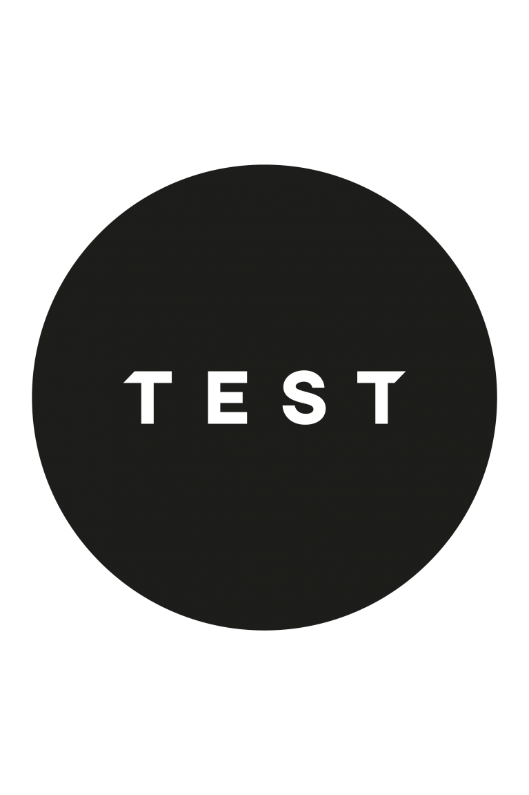

  <!-- You are encouraged to replace this logo with your own! Otherwise you can also remove it. -->
  
   

  <h3><b>Hello World Project ReadMe</b></h3>

### 👤 Author
  
**Nurbol Sultanov**

- GitHub: [@everinurmind](https://github.com/everinurmind)

# 📗 Table of Contents

- [📖 About the Project](#about-project)
  - [🛠 Built With](#built-with)
    - [Tech Stack](#tech-stack)
    - [Key Features](#key-features)
  - [🚀 Live Demo](#live-demo)
- [💻 Getting Started](#getting-started)
  - [Setup](#setup)
  - [Prerequisites](#prerequisites)
  - [Install](#install)
  - [Usage](#usage)
  - [Run tests](#run-tests)
  - [Deployment](#triangular_flag_on_post-deployment)
- [👥 Authors](#authors)
- [🔭 Future Features](#future-features)
- [🤝 Contributing](#contributing)
- [⭐️ Show your support](#support)
- [🙏 Acknowledgements](#acknowledgements)
- [📝 License](#license)

# 📖 Hello World 

**Hello World** is my first microverse project, which i start to understand the basics of GitHub.

## 🛠 Built With HTML & CSS 

### Tech Stack 

  
Client

  <ul>
    <li><a href="https://github.com/">GitHub Desktop</a></li>
  </ul>

  
Server

  <ul>
    <li><a href="https://github.com/">GitHub</a></li>
  </ul>

Database

  <ul>
    <li>Microverse</li>
  </ul>

### Key Features 

- [step by step repository creating] **[Creating repository]**
- [step by step Linters integration in a project] **[Linters Integration]**

(<a href="#readme-top">back to top</a>)

## 🚀 Live Demo 

- [Live Demo Link](https://github.com/everinurmind/Hello-World)

(<a href="#readme-top">back to top</a>)

## 💻 Getting Started 

To get a local copy up and running, follow these steps.

### Prerequisites

In order to run this project you need to get access to repository.

### Setup

Clone this repository to your desired folder.

### Install

Install this project.

### Run tests 

To run tests, run the following command:

- $ git status

### Deployment

You can deploy this project using:

- $ git push / (check for errors)

(<a href="#readme-top">back to top</a>)

## 👥 Author 

👤 **Nurbol Sultanov**

- GitHub: [@everinurmind](https://github.com/everinurmind)
- LinkedIn: [LinkedIn](https://www.linkedin.com/in/everinurmind)

## 🔭 Future Features 

- [step by step repository creating] **[Creating repository]**
- [step by step Linters integration in a project] **[Linters Integration]**

(<a href="#readme-top">back to top</a>)

## 🤝 Contributing 

Contributions, issues, and feature requests are welcome!

Feel free to check the [issues page](https://github.com/everinurmind/Hello-World/issues).

(<a href="#readme-top">back to top</a>)

## ⭐️ Show your support 

Please leave me review if you have any questions or remarks.

(<a href="#readme-top">back to top</a>)

## 🙏 Acknowledgments 

Thanks to my coding partner Hamza, for helping me on a way of learning this project.

(<a href="#readme-top">back to top</a>)

## 📝 License 

This project is [MIT](.LICENSE.md) licensed.

(<a href="#readme-top">back to top</a>)
